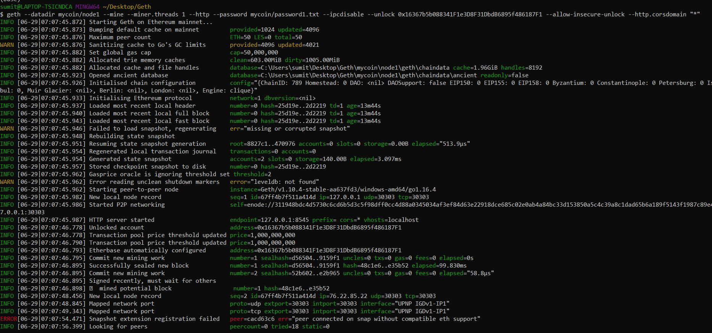
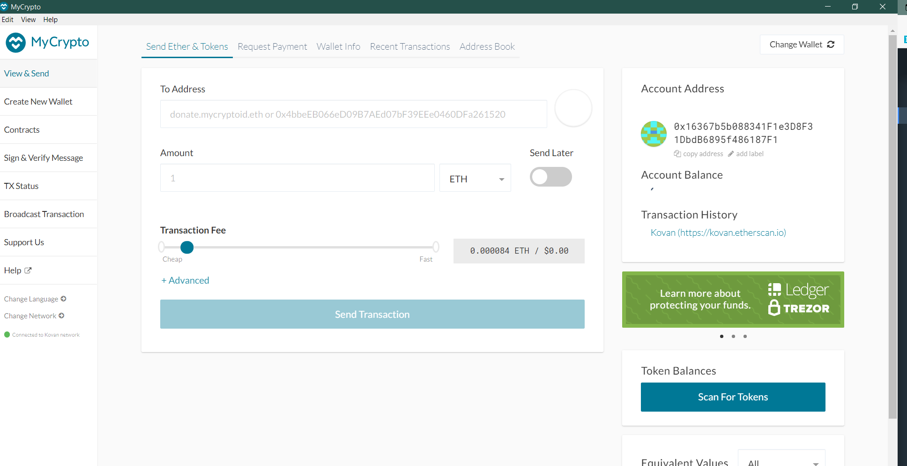

# Proof of Authority Development Chain 

## Install the geth node software

Download and install `geth` for your operating system here: <https://geth.ethereum.org/downloads/>

## Install the MyCrypto GUI wallet

Download and install the desktop version of the MyCrypto wallet here: <https://download.mycrypto.com/>

In the Gitbash terminal cd geth and then create 2 nodes.

## Node1
$ geth account new --datadir mycoin/node1

INFO [06-29|06:49:24.127] Maximum peer count                       ETH=50 LES=0 total=50

Your new account is locked with a password. Please give a password. Do not forget this password.

Password:123
Repeat password:123

Your new key was generated

Public address of the key:   0x16367b5b088341F1e3D8F31DbdB6895f486187F1

Path of the secret key file: mycoin\node1\keystore\UTC--2021-06-29T13-49-30.308816800Z--16367b5b088341f1e3d8f31dbdb6895f486187f1

## Node2
$ geth account new --datadir mycoin/node2

INFO [06-29|06:52:07.016] Maximum peer count                       ETH=50 LES=0 total=50

Your new account is locked with a password. Please give a password. Do not forget this password.

Password:123
Repeat password:123

Your new key was generated

Public address of the key:   0xeBBf5b91FF76CFFa822Eb374d20aDecF04F2e5fD

Path of the secret key file: mycoin\node2\keystore\UTC--2021-06-29T13-52-11.851898400Z--ebbf5b91ff76cffa822eb374d20adecf04f2e5fd

## puppeth

Now launch the puppeth to create the nprivate network using proof of authority algorithm.Network is configured for 5 seconds.

./puppeth --network mycoin

chain id  789

## Init

geth init mycoin.json --datadir mycoin/node1

geth init mycoin.json --datadir mycoin/node2

## Mining Node1
In one got bash terminal set up one node.

./geth --datadir mycoin/node1 --mine --miner.threads 1 --http --password mycoin/password1.txt --ipcdisable --unlock 0x16367b5b088341F1e3D8F31DbdB6895f486187F1 --allow-insecure-unlock --http.corsdomain "*"

enode://311948bdc4d5730c6cd6b5d3c5f98dff0cc4d88a0345034af3ef84d63e22918dce685c02e0ab4a84bc33d153850a5c4c39a8c1dad65b6a189f5143f1987c89e4@127.0.0.1:30303

## Mining Node2

In another gitbash terminal set up node 2.

./geth --datadir mycoin/node2 --port 30304 --bootnodes "enode://311948bdc4d5730c6cd6b5d3c5f98dff0cc4d88a0345034af3ef84d63e22918dce685c02e0ab4a84bc33d153850a5c4c39a8c1dad65b6a189f5143f1987c89e4@127.0.0.1:30303" --password mycoin/password2.txt --mine --ipcdisable --unlock 0xeBBf5b91FF76CFFa822Eb374d20aDecF04F2e5fD

## MyCrypto

In Mycrpto, I was unable to connect to the network. And the account balance was not displayed.  

